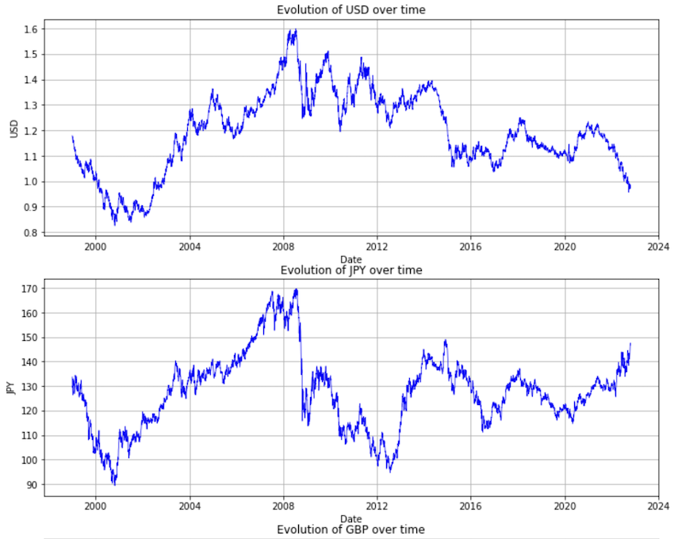
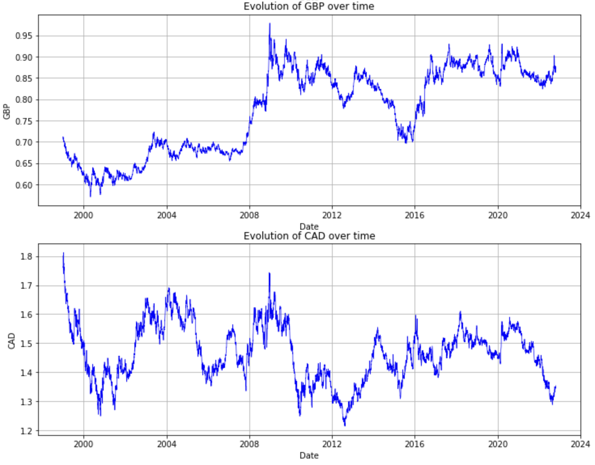

# Economic Scenario Generator

## Context

In the context of the "Counterparty Risk" project, which is related to the ability of the counterparty on the OTC markets to meet its commitments such as payment, delivery or repayment, it is essential to manage financial asset portfolios by taking into account different possible scenarios. This is where the 'ESG', an economic scenario generator, comes in to predict different risk factors over a period of several years.  

An ESG consists of a set of models (interest rates, equities, asset yields, credit spreads, inflation, etc.) allowing to randomly simulate possible evolution scenarios of the financial markets, which have an impact on the value and the performance of the assets. 

## Project motivations and purposes

After the financial crisis of 2008, states realized that economic risks could represent a threat to the community. As a result, stricter measures have been imposed on banks and insurance companies in terms of regulation and economic conduct. Among these measures we cite a better management of risks by modeling its factors. This project  aims to analyze and forecast the exchange rate as our main risk factor.  

Through an ESG we could simulate this variable by being consistent with its past evolutions, i.e. with the dynamics associated with it but also with the evolution of the dependency structure. Parametric or non-parametric methods like bootstrapping can be used, as well as generative machine learning models. 

During the project, we will work on exchange rate returns from past years and then use different methods for generating economic scenarios :
- Bootstrapping
- Restricted Boltzmann Machine (RBM)

## Structure of the code
This repository contains an abstract mother class for generating economic scenarios, as well as two child classes that inherit from the mother class: a `Bootstrap` class and a Restricted Boltzmann Machine `RBM` class.
These two classes are called by the `TimeSeries' class, which is used to train the generator and generate new scenarios.
- bootstrap contains the bootstrapping class. It allows to call Python functions which are going to generate bootstrap samples.
- esg contains the ESG class. It is the blueprint for the inheritance of the different ESG classes. It defines Python functions used by all the different methods.
- rbm contains the RBM and RBM_simple classes. It allows to call Python functions which are going to generate economic scenarios with RBM methods
- statistics_tools defines Python functions which give information about statistical properties and tests.
- timeseries contains the Timeseries class. This class uses the other classes and functions to get the results. It is the main running file.
- utils defines Python functions about returns, generation of samples or plot.

### Usage
To use the `EconomicScenarioGenerator` class, you will need to create a child class that implements the abstract methods defined in the mother class. You can then use the child class to train the generator to historical returns, generate new scenarios, and evaluate the performance of the generator by comparing the historical quantiles and the quantiles generated.


## The models

### Time series class

The Time series class defines 7 functions that we will use on the source data to process and generate the results :
- __init__ : initialize the class and keep the data needed;
- pre_processing : basic preprocessing of the data by choosing the way the missing values are filled, the method used to calculate the returns and whether the extreme values are kept ;
- plot : plot the prices or the returns ;
- statistics : compute the main statistics of the returns ;
- correlation : calculate the correlation matrix ;
- bootstrap_esg : generate the bootstrap samples ;
 - rbm_esg : generate the rbm samples.
It is the class called to generate results in our notebook.

#### Example 

```shell
symbols = ['USD', 'JPY', 'GBP', 'CAD']  
random.seed(14021999)
ts = TimeSeries(dftaux, symbols)
ts.pre_processing(method_return='arithmetic')
ts.plot(type_plot='rates')
```

Which gives the following plot :




```shell
ts.statistics()
```

Which gives the following table :


```shell
ts.correlation()
```

Which gives the following table :


### Economic scenario generator abstract class

The abstract class for the Economic Scenario Generator is the blueprint for the inheritance of the different ESG classes. In our case, we used it for the bootstrap and the rbm classes.
The class must implement the following functions:
- pre_processing : Preprocess the data ;
- train : Train the model on the train set ;
- generate : Generate the scenarios ;
- quantiles : Get the quantiles of the generated data ;
- correlation : Get the correlation matrix of the generated data ;
- plot_returns : Plot the returns of the initial data and the quantiles of the generated data.


### Bootstrapping

#### Bootstrap method

Statistics science is based on learning from data. Statistical methods are therefore essential to make decisions and predictions while the situation already occured. The traditional approach (or large sample approach) consists of drawing one sample of size n from the data and that sample is used to calculate the data estimated to make inferences on. But this method tends to take into account outliers. In order to tackle this issue, the bootstrapping method is a statistical procedure that resamples a single data to create many simulated samples. In our case, we are considering the past datas of each currency and we draw randomly as many as returns we need for each scenarios (for example : 100).

The block samples are chosen randomly to create bootstrap resamples, there are several ways to choose these blocks :

- Simple block bootstrap: we choose from blocks of a fixed length, delta_block.
- Moving block bootstrap: slightly more complicated since it allows to overlap of the blocks.

#### Analysis

Here, we analyse daily, weekly and monthly frequencies. To make these analysis, we have chosen to plot from 01-01-2020 by chosing 100 scenarios and 04-09-2021 as test date.
For each type of frequency we plot the correlation between the USD, the JPY, the GBP and the CAD currency.

#### Example 

This is a boostrap code example that corresponds to the daily frequency :

```shell
test_dates = '2021-09-04'
plot_from='2020-01-01'
scenarios = 100
ts.bootstrap_esg(scenarios=scenarios, test_date=test_dates, plot_from=plot_from)
```
Which gives us for the USD currency : 


### Restricted Boltzmann Machine
- explanation of the algorithm
- how to use it
- results

#### RBM method
A Restricted Boltzmann Machine is a two-layer network with stochastic activation units. Restricted means that there is no connection between units whithin the same layer. The layer which is exposed to the training data set is called the visible layer. Inputs from the visible layer flow through the network (forward pass) to the hidden layer.

Each hidden unit then ”fires” randomly − its output is a Bernoulli random variable: ”1” is generated with probability p, which is equal to the sigmoid activation function value, and ”0” is generated with probability 1 − p. The outputs from the hidden layer then flow back (backward pass) to the visible layer, where they are aggregated and added to the visible layer biases.

The network learns the joint distribution of the configurations of visible and hidden activation units by trying to reconstruct the inputs from the training data set (visible unit values) by finding an optimal set of the network weights and biases

Here is a schema to visualize hidden and visible units :


#### Code Structure
The RBM class gathers all the functions that allow to realize the model : 

- The __init__ function :  Initialise the RBM class with the ESG abstract class avec comme entrée les données encodées 

- The Encoding function : allows to transform the data into binary with the real data table as input 

- The Unencoding function : allows to decode the output of the binary algorithm into real data 

- The unpack_data function : transforms numpy to dataframe

- The pre_processing function : It takes the real data and encode it into binary by setting the min and max values used also for the encoding and It initialises the weights and biases 

- The qq_plot function : it draws the QQ plot for each variable to compare the real data and the generated data 

- The train function : it is the training function of the data with the k contrastive divergence method. For each batch among each of the epochs, weights and biases are updated and then for each epoch we compute the mean square error of the bias of visible/hidden layers and on weights. Then the generated output passes through the forward and backward passes and it is unencoded it the end.

- The generate function : allows to generate new data with the thermalization method which is based on the generation of new data. For each scenario, we take a random vector already trained on the previous weights and biases then we pass it K times (K represents the thermalization factor) in the forwards and backwards passes to be able to generate new data different from the historical ones.  

#### Results
Here are the results of the qq-plot :


## Contributors
Basile Hogenmuller alias @bashog
Simon Evanno alias @Simzer994
Viviane Feng alias @vivianefeng
Basma Bazi alias @basmabazi


