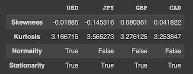

# Economic Scenario Generator

## Context

After the financial crisis of 2008, states realized that economic risks could represent a threat to the community. As a result, stricter measures have been imposed on banks and insurance companies in terms of regulation and economic conduct. Among these measures we cite a better management of risks by modeling its factors.


## Project motivations and purposes

An economic scenario generator (ESG) is a tool used by financial institutions to create simulations of potential future economic environments *such as interest rates, equities, asset yields, credit spreads, inflation, etc..* These simulations can be used for a variety of purposes, such as stress testing the institution's financial health, forecasting potential revenues and losses, and developing risk management strategies. 

During the project, we will work on exchange rate returns from past years and then use different methods for generating economic scenarios :
- Bootstrapping
- Restricted Boltzmann Machine (RBM)

The main goal is to be consistent with the past evolutions of the exchange rates and to be able to generate scenarios that are as close as possible to the real ones. We will then compare the results obtained with the different methods and see which one is the most efficient.

## Structure of the code

| Files | Description |
| --- | --- |
| timeseries | Main class to to process historical datas and generate scenarios|
| esg | abstract mother class for the esg |
| bootstrap | Bootstrap class |
| rbm | Restricted Boltzmann Machine class  |
| statistics_tools | Statistical functions |
| utils | Basic functions about returns, generation of samples or plot |

This repository contains an `esg` abstract mother class, the blueprint for the inheritance of the different ESG classes. It defines methods used buy the child classes :
- the `Bootstrap` class 
- the Restricted Boltzmann Machine `RBM` class.

These two classes are called by the `TimeSeries` class, the main running file, which is used to train the generator and generate new scenarios.

## Usage and explanation of models
We select 4 currencies : USD, JPY, GBP and CAD. We will then use the `TimeSeries` class to process the data and generate scenarios. The datas used for the generation are before 2021. We use the `Bootstrap` class and the `RBM` class to to generate scenarios of returns. We evaluate the performance of the generators by comparing the historical quantiles and the quantiles generated. 

### Time series class
The Time series class defines 7 functions that we will use on the source data to process and generate the results :
- `__init__` : initialize the class and keep the data needed;
- `pre_processing` : basic preprocessing of the data by choosing the way the missing values are filled, the method used to calculate the returns and whether the extreme values are kept ;
- `plot` : plot the prices or the returns ;
- `statistics` : compute the main statistics of the returns ;
- `correlation` : calculate the correlation matrix of the historical datas;
- `bootstrap_esg` : generate scenarios by using the bootstrap method ;
- `rbm_esg` : generate scenarios by using Restricted Boltzman Machine.

```python
symbols = ['USD', 'JPY', 'GBP', 'CAD']  
random.seed(14021999)
ts = TimeSeries(dftaux, symbols)
ts.pre_processing(method_return='arithmetic')
ts.plot(type_plot='rates')
```

**Evolution of the exchange rates over time :**


**Historical statistics :**
```python
ts.statistics()
```


**Historical correlation matrix :**
```python
ts.correlation()
```


### Bootstrap class
Bootstrapping is a statistical technique that resamples a particular dataset to produce a large number of simulated samples. Time series with correlated sample data are frequently used as economic data. 

The mean, for example, is unique to each simulated sample. At the end of the process, your simulated datasets contain numerous unique combinations of the original dataset's values.The importance of this method is to keep the correlation between the different currencies. 

The Bootstrap class defines 3 functions that we will use to generate scenarios :
- `__init__` : initialize the class and keep the data needed;
- `generate_scenarios` : generate scenarios by using the bootstrap method ;
- `plot` : plot the scenarios.

Here, we analyse daily, weekly and monthly frequencies. To make these analysis, we have chosen to plot from 01-01-2020 by chosing 100 scenarios and 04-09-2021 as test date.
For each type of frequency we plot the correlation between the USD, the JPY, the GBP and the CAD currency. 

```python
test_dates = '2021-09-04'
plot_from='2020-01-01'
scenarios = 100
ts.bootstrap_esg(scenarios=scenarios, test_date=test_dates, plot_from=plot_from)
```
**Which gives us for the USD currency :** 


**About the correletion of generated scenarios, we can see that the correlation is conserved.**


### Restricted Boltzmann Machine
> The implementation is based on the paper [The Market Generator](https://dx.doi.org/10.2139/ssrn.3384948) by Alexei Kondratyev, Christian Schwarz.

<span style="color:red">A restricted Boltzmann machine is a type of artificial neural network for unsupervised learning : a two layer network with stochastic activation units. The ‘Restricted’ term refers to the absence of connections between units in the same layer. But how does it work ?   

The first layer that receives the data is called the visible and the second is the hidden one and the nodes or the units are where calculations take place. Once received, the visible units transmit the input to the hidden layer (through the forward pass) which gives a random bernoulli variable as an output : the value "1" corresponds to the probability p which is equal to the sigmoid activation function and "0" corresponds to the probability 1-p. Then through the backward pass, the output obtained is combined using the weights and added to the biased values of the visible part. 

Thus, the initial data is reconstructed by updating weights and biases and the features of the joint distribution of visible and hidden nodes are exctracted. </span>

> More explanation are in the notebook


The RBM class gathers all the functions that allow to realize the model :
- `__init__`:  initialize the class and keep the data needed;
- `encoding`: allows to transform the data into binary with the real data table as input;
- `unencoding`: allows to decode the output of the binary algorithm into real data;
- `unpack_data`: transforms numpy to dataframe;
- `pre_processing`: It takes the real data and encode it into binary by setting the min and max values used also for the encoding and It initialises the weights and biases;
- `qq_plot`: it draws the QQ plot for each variable to compare the real data and the generated data;
- `mse`: Calculates the mean square error between two arrays of real data;
- `plot_mse` : plots the mse output;
- `train` : it is the training function of the data with the k contrastive divergence method. For each batch among each of the epochs, weights and biases are updated by using the gradient descent method;
- `generate_scenarios`: allows to generate new data with the thermalization method which is based on the generation of new data. For each scenario, we take a random vector already trained on the previous weights and biases then we pass it K times (K represents the thermalization factor) in the forwards and backwards passes to be able to generate new data different from the historical ones;  

```python	
test_dates = '2021-09-04'
plot_from='2020-01-01'
scenarios = 10
epochs = 10000
lr = 0.015
windows = 5
K = 150 # for the generation of sample
ts.rbm_esg(scenarios, epochs, lr, K, test_dates, plot_from, windows, parallel=True)
```

**The QQ plot to compare the real data and the output of the RBM :**


**The correlation matrix of the output of the RBM :**


**The correlation matrix of the generated scenarios :**


**The quantiles of the generated scenarios compared with the historical quantiles:**


## Contributors
- Basile Hogenmuller alias @bashog
- Simon Evanno alias @Simzer994
- Viviane Feng alias @vivianefeng
- Basma Bazi alias @basmabazi
- Khaoula Lamtouni alias @Klamtouni


